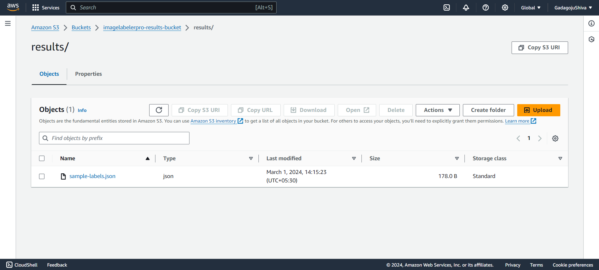

<h1 style="text-align: center">
    <span style="color: rgb(255, 0, 0);">I</span>
    <span style="color: rgb(0, 128, 0);">M</span>
    <span style="color: rgb(0, 0, 255);">A</span>
    <span style="color: rgb(255, 165, 0);">G</span>
    <span style="color: rgb(128, 0, 128);">E</span>
    <span style="color: rgb(250, 0, 250);">-</span>
    <span style="color: rgb(255, 255, 0);">L</span>
    <span style="color: rgb(0, 128, 128);">A</span>
    <span style="color: rgb(255, 192, 203);">B</span>
    <span style="color: rgb(165, 42, 42);">E</span>
    <span style="color: rgb(128, 128, 128);">L</span>
    <span style="color: rgb(0, 0, 128);">E</span>
    <span style="color: rgb(128, 0, 0);">R</span>
    <span style="color: rgb(250, 0, 250);">-</span>
    <span style="color: rgb(255, 215, 0);">P</span>
    <span style="color: rgb(75, 0, 130);">R</span>
    <span style="color: rgb(0, 255, 0);">O</span>
</h1>

## Table of Contents

- [Table of Contents](#table-of-contents)
- [Description](#description)
- [Architecture](#architecture)
- [Setting Up AWS Resources](#setting-up-aws-resources)
  - [Creating a Lambda Execution Role](#creating-a-lambda-execution-role)
  - [Creating S3 Buckets](#creating-s3-buckets)
- [Creating Lambda Function](#creating-lambda-function)
- [Configuring S3 Trigger](#configuring-s3-trigger)
- [Uploading Images and Verifying Results](#uploading-images-and-verifying-results)
- [Conclusion](#conclusion)

## Description

ImageLabelerPro is a project that automates the process of labeling images using AWS Lambda and Rekognition services. This project provides a step-by-step guide on setting up the required AWS resources, creating Lambda functions, and configuring triggers to label images automatically. The labeled results are stored in a designated S3 bucket for easy access.

## Architecture 


ImageLabelerPro works like a helpful wizard in the cloud! The wizard, called `imagelabelerpro-label-Function 🧙‍♂️`, uses a special tool called Amazon Rekognition to look at pictures and tell us what's in them. When you put a picture in the magic bucket (`imagelabelerpro-upload-bucket 🪣`), the wizard wakes up and starts working on it. The results, like a list of magic words, are kept safe in another bucket (`imagelabelerpro-results-bucket 📦`). It's super easy for anyone to upload pictures, let the wizard do its thing, and then check what the wizard found in the results bucket. The wizard has a special role that lets it do its magic, like opening doors to other tools and talking to Amazon Rekognition. This setup makes ImageLabelerPro a simple and powerful way to understand what's in pictures using the cloud magic! ✨

## Setting Up AWS Resources

### Creating a Lambda Execution Role

- Go to the IAM Roles Console.
- Create a new role named **ImageLabelerProLambdaRole** with the following policies:
  - AWSLambdaBasicExecutionRole
  - AmazonS3FullAccess
  - AmazonRekognitionFullAccess
      

### Creating S3 Buckets

- Go to the Amazon S3 Console.
- Create a new S3 bucket for image uploads, e.g., **imagelabelerpro-upload-bucket**.
- Create another S3 bucket for storing labeled results, e.g., **imagelabelerpro-results-bucket**.
- Ensure that the results bucket has public access. Use the following policy:
    ```json
    {
      "Version": "2012-10-17",
      "Statement": [
        {
          "Sid": "PublicReadGetObject",
          "Effect": "Allow",
          "Principal": "*",
          "Action": ["s3:GetObject"],
          "Resource": ["arn:aws:s3:::imagelabelerpro-results-bucket/*"]
        }
      ]
    }
    ```

## Creating Lambda Function

- Go to the Lambda Console.
- Create a new function named **imagelabelerpro-label-Function**.
- Select Runtime as `Python 3.8`
- Select the role that we have created earlier - `ImageLabelerProLambdaRole`
- Copy the provided code and paste it into the function - [imagelabelerpro-label-function](./Source/imagelabelerpro-label-fnction.py)
- Update the output bucket name in the code to match your results bucket.
    
- **Note:** Now Go to Configurations tab and in general configuration change the timeout from `3 sec to 10 sec` otherwise you may get timeout error
- Deploy the function.

## Configuring S3 Trigger

- In the Lambda Console designer or diagram section, click on "Add Trigger."
    .png)
- Select S3 and choose the upload bucket (**imagelabelerpro-upload-bucket**).
    

- Click on Save.

## Uploading Images and Verifying Results

- Upload an image to the upload bucket (**imagelabelerpro-upload-bucket**).
    
- Go to the results bucket (**imagelabelerpro-results-bucket/results**).
    


- Click on the labeled image and view the JSON-formatted output.
    
    
- Click on the object-url
    

## Conclusion

ImageLabelerPro simplifies the process of image labeling using AWS services. Follow the provided steps to set up the necessary resources, create Lambda functions, and verify the labeled results. Thank you for using ImageLabelerPro!
